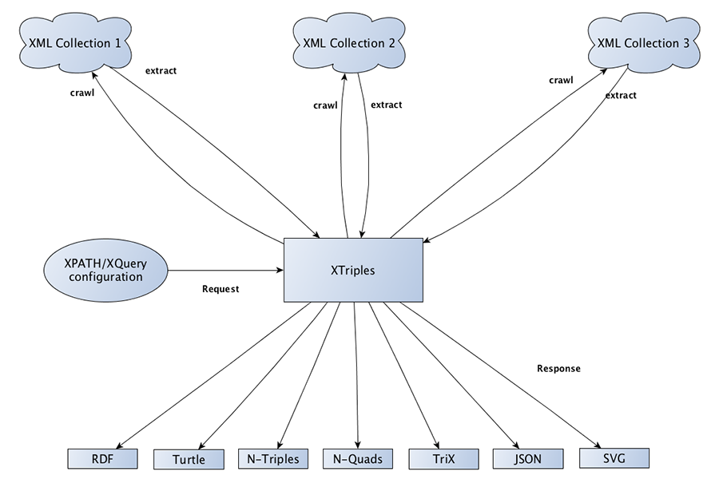
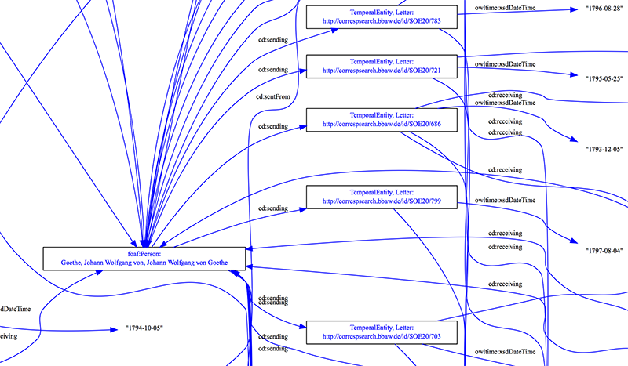

### Workhshop der AG Elektronisches Publizieren | 15.09.2015
# Digitale Briefeditionen im Semantic Web
## Der XTriples Webservice –   Semantische Aussagen aus XML
### __Torsten Schrade (Mainz) |  [@digicademy](https://twitter.com/digicademy "Die Digitale Akademie aut Twitter") |   [digicademy](https://github.com/digicademy "Die Digitale Akademie aut GitHub")__

---

## Gliederung

1. Implizite und explizite Semantik
2. Beispielmodellierung für &lt;correspDesc&gt;
3. XTriples in 3 Minuten
4. Visualisierungsbeispiele

---

## Implizite und explizite Semantik

---

## Semantische Fragestellungen

* Wer korrespondiert mit wem?
* Wieviele Briefe sind von Dichtern/Wissenschaftlern/etc.?
* Welche Berufsgruppen schrieben an Carl Maria von Weber?
* In welcher Stadt wurden die meisten Briefe verschickt/empfangen?
* Zwischen welchen Städten wurden Briefe verschickt?
* Wer war in welcher Stadt und wann?
* Wo war Person X im Jahr Y?

---

## Implizite Semantik (TEI-XML)

<pre>
<code class="xml">
&lt;correspDesc key="686" cs:source="#SOE20"&gt;
	&lt;correspAction type="sent"&gt;
		&lt;persName ref="http://d-nb.info/gnd/118540238"&gt;
			Johann Wolfgang von Goethe
		&lt;/persName&gt;
		&lt;placeName ref="http://www.geonames.org/2812482"&gt;
			Weimar
		&lt;/placeName&gt;
		&lt;date when="1793-12-05"&gt;5.12.1793&lt;/date&gt;
	&lt;/correspAction&gt;
	&lt;correspAction type="received"&gt;
		&lt;persName ref="http://d-nb.info/gnd/118805193"&gt;
			Soemmerring, Samuel Thomas
		&lt;/persName&gt;
		&lt;placeName ref="http://www.geonames.org/2874225"&gt;
			Mainz
		&lt;/placeName&gt;
	&lt;/correspAction&gt;
&lt;/correspDesc&gt;
</code>
</pre>

---

## Explizite Semantik (RDF)

<form>
	<textarea class="code" name="code" id="code1">
	PREFIX v: &lt;http://www.beispiel.verben#&gt;

	Goethe 			v:ist				Person ;
					v:sendet			Brief .

	Brief			v:datiert			1793 ;
					v:gesendet_aus		Weimar .

	Weimar			v:ist				Stadt ;
					v:hat_Laengengrad	11.32 ;
					v:hat_Breitengrad	50.98 .

	Soemmering		v:ist				Person ;
					v:empfaengt			Brief .

	Brief			v:empfangen_in		Mainz .
	</textarea>
</form>

---

## Beispielmodellierung

---

## Schritte zur Modellierung

<ol class="steps">
<li><a href="#/step-2/#step1" id="step1">1</a></li>
<li><a href="#/step-2/#step2" id="step2">2</a></li>
<li><a href="#/step-2/#step3" id="step3">3</a></li>
<li><a href="#/step-2/#step4" id="step4">4</a></li>
<li><a href="#/step-2/#step5" id="step5">5</a></li>
<li><a href="#/step-2/#step6" id="step6">6</a></li>
<li><a href="#/step-2/#step7" id="step7">7</a></li>
</ol>

<ul class="legend">
<li id="cs">correspSearch</li>
<li id="gnd">GND</li>
<li id="geonames">Geonames</li>
</ul>

---

## XTriples in 3 Minuten

---

## Website und Dokumentation

[http://xtriples.spatialhumanities.de](http://xtriples.spatialhumanities.de "Zur Website des Webservices")

---

## Eckdaten

* Open Source (MIT License)
* Version 1.2 (Stable)
* Veröffentlicht auf GitHub  (https://github.com/spatialhumanities/xtriples)
* Voll ausdokumentiert mit Beispielen  (http://xtriples.spatialhumanities.de/documentation.html)
* eXist-db basierte App

---

## Funktionsweise

---

## Extraktion von Aussagemustern

<pre><code class="xml">
#### XML ####
&lt;correspAction type="sent"&gt;
	&lt;persName ref="http://d-nb.info/gnd/118540238"&gt;
		Johann Wolfgang von Goethe
	&lt;/persName&gt;
&lt;/correspAction&gt;

#### Aussagemuster ###
&lt;statement&gt;
	&lt;subject>//tei:correspAction[@type='sent']/tei:persName/@ref&lt;/subject>
	&lt;predicate prefix="rdf">type&lt;/predicate>
	&lt;object type="uri" prefix="cd">Sender&lt;/object>
&lt;/statement&gt;

#### Ergebnis ####
gndo:118540238 rdf:type cd:Sender .
</code></pre>

---

## Visualisierungsbeispiele

---

## Goethe: Wer schreibt wem? (SVG)

<svg xmlns:xlink="http://www.w3.org/1999/xlink" xmlns="http://www.w3.org/2000/svg" width="800pt" height="256pt" viewBox="0.00 0.00 914.00 256.00">
<g id="graph0" class="graph" transform="scale(1 1) rotate(0) translate(4 252)">
<title>d1e200</title>
<polygon style="fill:white;stroke:white;" points="-4,4 -4,-252 910,-252 910,4 -4,4"/>
<!-- http://d&#45;nb.info/gnd/118805193 -->
<g id="node1" class="node">
            <title>http://d-nb.info/gnd/118805193</title>
<a xlink:href="http://d-nb.info/gnd/118805193" xlink:title="foaf:Person:\nSoemmerring, Samuel Thomas">
<polygon style="fill:none;stroke:black;" points="210,-248 44,-248 44,-214 210,-214 210,-248"/>
<text text-anchor="middle" x="127" y="-235" style="font-family:Times New Roman;font-size:10.00px;fill:blue;">foaf:Person:</text>
<text text-anchor="middle" x="127" y="-222" style="font-family:Times New Roman;font-size:10.00px;fill:blue;">Soemmerring, Samuel Thomas</text>
</a>
</g>
<!-- http://d&#45;nb.info/gnd/118540238 -->
<g id="node3" class="node">
            <title>http://d-nb.info/gnd/118540238</title>
<a xlink:href="http://d-nb.info/gnd/118540238" xlink:title="foaf:Person:\nGoethe, Johann Wolfgang von, Johann Wolfgang von Goethe">
<polygon style="fill:none;stroke:black;" points="680,-172 382,-172 382,-138 680,-138 680,-172"/>
<text text-anchor="middle" x="531" y="-159" style="font-family:Times New Roman;font-size:10.00px;fill:blue;">foaf:Person:</text>
<text text-anchor="middle" x="531" y="-146" style="font-family:Times New Roman;font-size:10.00px;fill:blue;">Goethe, Johann Wolfgang von, Johann Wolfgang von Goethe</text>
</a>
</g>
<!-- http://d&#45;nb.info/gnd/118805193&#45;&gt;http://d&#45;nb.info/gnd/118540238 -->
<g id="edge2" class="edge">
            <title>http://d-nb.info/gnd/118805193-&gt;http://d-nb.info/gnd/118540238</title>
<path style="fill:none;stroke:blue;" d="M210,-228C258,-225 318,-220 371,-209 408,-201 448,-187 479,-176"/>
<polygon style="fill:blue;stroke:blue;" points="481.015,-178.964 489,-172 478.415,-172.464 481.015,-178.964"/>
<text text-anchor="middle" x="318" y="-226.5" style="font-family:Times New Roman;font-size:10.00px;">cd:sending</text>
</g>
<!-- http://d&#45;nb.info/gnd/118540238&#45;&gt;http://d&#45;nb.info/gnd/118805193 -->
<g id="edge12" class="edge">
            <title>http://d-nb.info/gnd/118540238-&gt;http://d-nb.info/gnd/118805193</title>
<path style="fill:none;stroke:blue;" d="M382,-172C343,-177 303,-184 265,-192 240,-197 214,-204 191,-211"/>
<polygon style="fill:blue;stroke:blue;" points="189.573,-207.774 181,-214 191.584,-214.479 189.573,-207.774"/>
<text text-anchor="middle" x="318" y="-195.5" style="font-family:Times New Roman;font-size:10.00px;">cd:sending</text>
</g>
<!-- http://d&#45;nb.info/gnd/122361261 -->
<g id="node8" class="node">
            <title>http://d-nb.info/gnd/122361261</title>
<a xlink:href="http://d-nb.info/gnd/122361261" xlink:title="foaf:Person:\nWeber, Genovefa">
<polygon style="fill:none;stroke:black;" points="905,-172 809,-172 809,-138 905,-138 905,-172"/>
<text text-anchor="middle" x="857" y="-159" style="font-family:Times New Roman;font-size:10.00px;fill:blue;">foaf:Person:</text>
<text text-anchor="middle" x="857" y="-146" style="font-family:Times New Roman;font-size:10.00px;fill:blue;">Weber, Genovefa</text>
</a>
</g>
<!-- http://d&#45;nb.info/gnd/118540238&#45;&gt;http://d&#45;nb.info/gnd/122361261 -->
<g id="edge10" class="edge">
            <title>http://d-nb.info/gnd/118540238-&gt;http://d-nb.info/gnd/122361261</title>
<path style="fill:none;stroke:blue;" d="M680,-155C722,-155 765,-155 798,-155"/>
<polygon style="fill:blue;stroke:blue;" points="798,-158.5 808,-155 798,-151.5 798,-158.5"/>
<text text-anchor="middle" x="744" y="-158.5" style="font-family:Times New Roman;font-size:10.00px;">cd:sending</text>
</g>
<!-- http://d&#45;nb.info/gnd/115363688 -->
<g id="node4" class="node">
            <title>http://d-nb.info/gnd/115363688</title>
<a xlink:href="http://d-nb.info/gnd/115363688" xlink:title="foaf:Person:\nLuise Augusta Herzogin von Sachsen-Weimar und\nEisenach">
<polygon style="fill:none;stroke:black;" points="253,-183.5 1,-183.5 1,-136.5 253,-136.5 253,-183.5"/>
<text text-anchor="middle" x="127" y="-170.5" style="font-family:Times New Roman;font-size:10.00px;fill:blue;">foaf:Person:</text>
<text text-anchor="middle" x="127" y="-157.5" style="font-family:Times New Roman;font-size:10.00px;fill:blue;">Luise Augusta Herzogin von Sachsen-Weimar und</text>
<text text-anchor="middle" x="127" y="-144.5" style="font-family:Times New Roman;font-size:10.00px;fill:blue;">Eisenach</text>
</a>
</g>
<!-- http://d&#45;nb.info/gnd/115363688&#45;&gt;http://d&#45;nb.info/gnd/118540238 -->
<g id="edge4" class="edge">
            <title>http://d-nb.info/gnd/115363688-&gt;http://d-nb.info/gnd/118540238</title>
<path style="fill:none;stroke:blue;" d="M254,-155C258,-155 261,-155 265,-155 300,-154 337,-154 372,-154"/>
<polygon style="fill:blue;stroke:blue;" points="372,-157.5 382,-154 372,-150.5 372,-157.5"/>
<text text-anchor="middle" x="318" y="-158.5" style="font-family:Times New Roman;font-size:10.00px;">cd:sending</text>
</g>
<!-- http://d&#45;nb.info/gnd/117158542 -->
<g id="node6" class="node">
            <title>http://d-nb.info/gnd/117158542</title>
<a xlink:href="http://d-nb.info/gnd/117158542" xlink:title="foaf:Person:\nWeber, Franz Anton">
<polygon style="fill:none;stroke:black;" points="181,-115 73,-115 73,-81 181,-81 181,-115"/>
<text text-anchor="middle" x="127" y="-102" style="font-family:Times New Roman;font-size:10.00px;fill:blue;">foaf:Person:</text>
<text text-anchor="middle" x="127" y="-89" style="font-family:Times New Roman;font-size:10.00px;fill:blue;">Weber, Franz Anton</text>
</a>
</g>
<!-- http://d&#45;nb.info/gnd/117158542&#45;&gt;http://d&#45;nb.info/gnd/118540238 -->
<g id="edge6" class="edge">
            <title>http://d-nb.info/gnd/117158542-&gt;http://d-nb.info/gnd/118540238</title>
<path style="fill:none;stroke:blue;" d="M181,-106C237,-114 326,-126 400,-137"/>
<polygon style="fill:blue;stroke:blue;" points="399.701,-140.488 410,-138 400.398,-133.522 399.701,-140.488"/>
<text text-anchor="middle" x="318" y="-133.5" style="font-family:Times New Roman;font-size:10.00px;">cd:sending</text>
</g>
<!-- http://d&#45;nb.info/gnd/118540246 -->
<g id="node9" class="node">
            <title>http://d-nb.info/gnd/118540246</title>
<a xlink:href="http://d-nb.info/gnd/118540246" xlink:title="foaf:Person:\nGoethe, Katharina Elisabeth">
<polygon style="fill:none;stroke:black;" points="202,-59 52,-59 52,-25 202,-25 202,-59"/>
<text text-anchor="middle" x="127" y="-46" style="font-family:Times New Roman;font-size:10.00px;fill:blue;">foaf:Person:</text>
<text text-anchor="middle" x="127" y="-33" style="font-family:Times New Roman;font-size:10.00px;fill:blue;">Goethe, Katharina Elisabeth</text>
</a>
</g>
<!-- http://d&#45;nb.info/gnd/118540246&#45;&gt;http://d&#45;nb.info/gnd/118540238 -->
<g id="edge8" class="edge">
            <title>http://d-nb.info/gnd/118540246-&gt;http://d-nb.info/gnd/118540238</title>
<path style="fill:none;stroke:blue;" d="M202,-58C219,-62 237,-66 254,-70 307,-82 320,-83 371,-99 407,-109 446,-123 477,-134"/>
<polygon style="fill:blue;stroke:blue;" points="476.415,-137.536 487,-138 479.015,-131.036 476.415,-137.536"/>
<text text-anchor="middle" x="318" y="-102.5" style="font-family:Times New Roman;font-size:10.00px;">cd:sending</text>
</g>
</g>
</svg>

[Visualisierung aufrufen](http://xtriples.spatialhumanities.de/extract.xql?configuration=http://xtriples.spatialhumanities.de/examples/dh/correspSearchPersons.xml&format=svg "Zur Visualisierung von Wer schreibt Wem")

---

## Goethe: Briefnetzwerk (SVG)

[Visualisierung aufrufen](http://xtriples.spatialhumanities.de/extract.xql?configuration=http://xtriples.spatialhumanities.de/examples/dh/correspSearchLetters.xml&format=svg "Zur Visualisierung von Goethes Briefnetzwerk")

---

## Goethe: Berufe

---

## Kartenvisualisierung

---

<pre><code class="xml">
Publikum		v:war			aufmerksam .
Referenten		v:danken		Publikum .
</code></pre>

---

## Abspann

Stuff used: